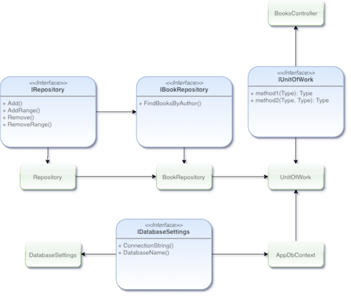

import VideoPlayer from '../../../src/components/VideoPlayer'

## Brief Overview
This is not a full blown tutorial of creating a web api or using MongoDB. 
It is a demonstration of my understanding of how to create and use an (API)[#unfamilar-terms].

As an aspiring Software Engineer, I have started learning how to write APIs with Microsoft's Asp.net Core Web API. 
I have created a simple CRUD API using a Book model that will be stored in a MongoDB backend. 
This API will then be used in later posts in a ReactJS, AngularJS, and a Razor Application 
to demonstrate my skills with creating these different applicaitons with an API I have created.

For this application I will be using Visual Studio 2019 to create and run the developed app. 
Visual Studio and MongoDB will need to be installed and running. MongoDB will also need a database name and collection with sample data.
The database name I have chosen is `BooksDB` and the collection is called `Books`. 
MongoDB is case sensitive and when using the MongoDB Driver NuGet package 
when matching up the database name, collection, and field names, will match the letter-case found in the MongoDB. 
This can be remedied for the model by using `BSON` helpers when pulling the in the model fields. 

This application will be using a `Book` model and test out the (CRUD)[#unfamilar-terms] API endpoints.

## Design and Usage
In designing my application I viewed different tutorials and other people's explanations
of how to use the Repository Pattern and how to create an API using Asp.net Web Core. 
These [resources](#resources) can be found below.

In creating my API, I used generics to allow less coupling of code. This design will allow extensability 
to other `model objects` other than the `Book Model Object` I decided to use. I chose this because Microsoft
original tutorial I found combining MongoDB with Asp.net Core Web API used a book model. As well as several of their
other tutorials discussing APIs used the book Model.

Here is a diagram representing my flow of interfaces and objects. The items with green background are objects that are
instantiated and are extending or using several different interfaces or other implementations.



The diagram above depics an IRepository, IBookRepository, IDatabaseSettings, and a IUnitOfWork as the interfaces.
The IBookRepository extends the IRepository, and adds its own methods dealing specifically with books. 
The BookRepository object then implements those added methods and inherits the already 
implemented IRepository methods from the Repository object.

The AppDbContext object receives an IDatabaseSettings through its constructor that is implemented by the DatabaseSettings object. 
The DatabaseSettings is then instantiated and injected into the AppDbContext parameter on application startup. 
AppDbContext is also instantiated on startup. The AppDbContext instantiation is then passed into the UnitOfWork through one of its parameters
and is instantiated in the BooksController.

The BooksController is where all the API calls are received and executed and it uses the methods given by the UnitOfWork. 
The UnitOfWork also instantiates an instance of the BookRepository on its creation. 
Now all the methods from the IRepository and IBookRepository are available to the BooksController through the UnitOfWork object.

## Hands On
Now it is time to get our hands working. I will show a few snippets of the code I have.

### The Code
The json file below is where we will set up our database settings.
```json
// File: books.api.v1/appsettings.json
{
  "DatabaseSettings": {
    "DatabaseName": "BooksDb",
    "ConnectionString": "mongodb://localhost:27017"
  }
  ...
}
```

The code below is a sample declaration of the `IRepository`.
```csharp
// File: books.api.v1/Services/Repositories/IRepository.cs
public interface IRepository<TEntity, TPrimaryKey> where TEntity : IEntity<TPrimaryKey>
{
    TEntity Get(string id);
    IEnumerable<TEntity> GetAll();
    IEnumerable<TEntity> Find(Expression<Func<TEntity, bool>> predicate);

    TEntity SingleOrDefault(Expression<Func<TEntity, bool>> predicate);

    void Add(TEntity entity);
    void AddRange(IEnumerable<TEntity> entities);

    void Remove(TEntity entity);
    void RemoveRange(IEnumerable<TEntity> entities);
    void Remove(string id);
    void RemoveRange(IEnumerable<string> id);
}
public interface IEntity<out TKey>
{
    string Id { get; }
}
```

The code below is sample interface for the `IBookRepository`.
```csharp
// File: books.api.v1/Services/Repositories/IBookRepository.cs
public interface IBookRepository : IRepository<Book, string>
{
    IEnumerable<Book> GetBooksWithDescriptions(int id);
}
```
The code below is the `Book` model I will be using.
```csharp
// File: books.api.v1/Models/Book.cs
public class Book : IEntity<string>
{
    [BsonId]
    [BsonRepresentation(BsonType.ObjectId)]
    public string Id { get; set; }
    public string Title { get; set; }
    public string Description { get; set; }
    public string Authors { get; set; }
    public string Genre { get; set; }
    public int Words { get; set; }
    public int Pages { get; set; }
    public int Chapters { get; set; }
    public DateTime Created { get; set; }
    public DateTime Modified { get; set; }

}
```

Full code can be found on [Github](https://github.com/TechReaderJake/MongoDbWebApi).
The project is named MongoDbWebApi.

### Running the Application
Once we have all the code ready ([fell free to download the code from my repo](https://github.com/TechReaderJake/MongoDbWebApi)) 
and matched up we can run the application by hitting F5 or clicking the run button in Visual Studio.
Once it is running we can test it using [Postman](https://getpostman.com).
Postman is an application that we can install locally and test local API endpoint requests.

## Demo
Here is a demo of the working API using the Repository Pattern and testing the endpoints with Postman.

<VideoPlayer src="r9xlSr0q_Vw" />

## Unfamilar Terms
- API
    - Is an acronym that stands for Application Programming Interface.
    This is usually done by exposing specific endpoints (ex: URLs) to allow others with a token
    make controlled calls to an applications data.
- CRUD
    - Is an acronym that stands for Create, Read, Update, Delete.
- Repostiory Pattern
    - Is a programming pattern that allows a separation of concerns. 
    In other words a decoupling of programming parts.

## Resources
- [Microsoft MongoDB Tutorial](https://docs.microsoft.com/en-us/aspnet/core/tutorials/first-mongo-app?view=aspnetcore-2.2&tabs=visual-studio#add-a-configuration-model-1)
- [Repository Pattern](https://www.youtube.com/watch?v=rtXpYpZdOzM)
- [Web Api MongoDB](https://github.com/fpetru/WebApiMongoDB)
- [Bethany's Pie Shop Mobile](https://github.com/GillCleeren/BethanysPieShopMobile)
